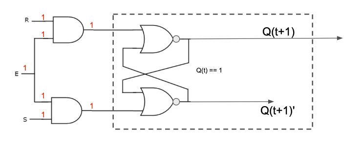
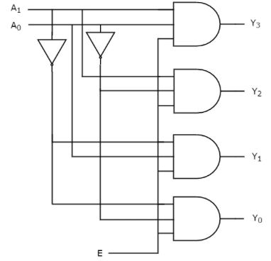

# Digitial Logic 
## Name:                                            <!-- response -->
## GitHub Account:                                  <!-- response -->

### Boolean Algebra
1. Given the following circuit, provide the equivalent Boolean expression:
   *                                      <!-- response -->
   

 
1. Given the following truth table, provide the equivalent Boolean expression:
   *                                      <!-- response -->

   | A  | B  | C | Output |
   | -- | -- |-- | -- |
   | 0| 0 | 0  | 0 |
   | 0 | 0 | 1 | 1 |
   | 0 | 1 | 0 | 1 |
   | 0 | 1 | 1 | 0 |
   | 1 | 0 | 0 | 1 |
   | 1 | 0 | 1 | 1 |
   | 1 | 1 | 0 | 1 |
   | 1 | 1 | 1 | 0 |

1. Convert the following truth table into a Karnaugh map.<br>
   (Make sure you update all of the x-s in the answer template.)
   
   | A | B | C | Output |
   | - | - | - | ------ |
   | 0 | 0 | 0 |   0    |
   | 0 | 0 | 1 |   1    |
   | 0 | 1 | 0 |   1    |
   | 0 | 1 | 1 |   0    |
   | 1 | 0 | 0 |   1    |
   | 1 | 0 | 1 |   1    |
   | 1 | 1 | 0 |   1    |
   | 1 | 1 | 1 |   1    |

   ```
   |   |   | BC | BC | BC | BC |          <!-- response -->
   |   |   | xx | xx | xx | xx |          <!-- response -->
   |---|---| -- | -- | -- | -- |          <!-- response -->
   | A | x | x  | x  | x  | x  |          <!-- response -->
   | A | x | x  | x  | x  | x  |          <!-- response -->
   ```


1. Simplify the following Boolean expressions:<br>
   1. ``A * ( B + C) + A' * ( B + C) ``
      *                           <!-- response -->
   1. ``AB' + A'B + AB``
      *                           <!-- response -->
   1. ``(AB' + A'B + AB)'``
      *                           <!-- response -->


1. You are provided with a truth table. By what method can you use to determine the equivalent Boolean algebra expression. (Your answer needs to be provided by a simple sentence.)
   ```
                                                    <!-- response -->
   ```

<!-- For the next two questions, you need not include the response tags -->
1. Update the following Karnaugh map by replacing the x's to provide the missing labeling information.

   |   |   | BC <br> xx | BC <br> xx | BC <br> xx | BC <br> xx |   
   |---|---|         -- |         -- |         -- |         -- |   
   | A | x |         1  |         0  |         0  |         1  |   
   | A | x |         1  |         0  |         1  |         1  |   


1. For the Karnaugh map in the previous question, provide the equivalent truth table.
   
   | A | B | C | Output |
   | - | - | - | ------ |
   | 0 | 0 | 0 |        |
   | 0 | 0 | 1 |        |
   | 0 | 1 | 0 |        |
   | 0 | 1 | 1 |        |
   | 1 | 0 | 0 |        |
   | 1 | 0 | 1 |        |
   | 1 | 1 | 0 |        |
   | 1 | 1 | 1 |        |

1. Using the above Karnaugh map, provide the equivalent Boolean expressions.
   *                                              <!-- response -->

1. Using the above truth table, provide the equivalent Boolean expression. Do NOT take steps to simplify the resulting Boolean expression.
   *                                              <!-- response -->


1. Provide an example for each of the following Boolean algebra properties.

   *  associative property:  
      - `A + B == B + A`                          <!-- response: example: is this correct? -->
   *  idempotent:
      -                                           <!-- response -->
   *  absorption property:  
      -                                           <!-- response -->
   *  commutative property:  

      -                                           <!-- response -->
   *  distributive property:  
      -                                           <!-- response -->
   *  identity property:
      -                                           <!-- response -->
   *  definition of XOR:
      -                                           <!-- response -->
   *  annulment:
      -                                           <!-- response -->
   *  complement:
      -                                           <!-- response -->


1. Show the steps to show that `C'(B'C + ABC') + A(BC' + 1)` is equivalent to `A`.
   *  C'(B'C + ABC') + A(BC' + 1)  : given        <!-- response -->
   *                                              <!-- response -->
   *                                              <!-- response -->
   <!-- Add or Delete response lines above as necessary -->


### Circuits

1. You are given a SR latch that is storing the value of 1. You then provide the following values for inputs:  E=1, S=1, and R=1.  What is the final value for Q(t+1) and for Q(t+1)' ?
   * Q(t+1) :                                     <!-- response -->
   * Q(t+1)':                                     <!-- response -->




1. You are asked to build a register bank. Identify which of the following digital components you need. (To answer this question, simply remove the digital components your don't need.)
   * Half Adder                                   <!-- response -->
   * Encoder                                      <!-- response -->
   * Decoder                                      <!-- response -->
   * ALU                                          <!-- response -->
   * Multiplexer                                  <!-- response -->
   * Latch                                        <!-- response -->
   * Barrel Shifter                               <!-- response -->
   * FlipFlop                                     <!-- response -->

       
1. Can all programs be computed via a combinational circuit, yes or no?
   *                                              <!-- response -->
   * Explain your answer:<br>
    <!-- Add additional lines, including the appropriate response tags, in the block below. -->
     ```
                                                  <!-- response -->
    ```
1. What is the difference between a control line and a data line?
   *                                      <!-- response -->

1. You have been asked to produce a combinational circuit that can select exactly 1 output from 16 different possible inputs.
   1. What basic combinational ciruit should be used?
      *                                   <!-- response -->
   1. How many selector lines will this circuit have?
      *                                   <!-- response -->

1. You have a CPU that has 120 registers. (Yes, 120 registers!)
   1. How many selector lines are included in this circuit
      *                                  <!-- response -->

1. Consider the following circuit

   

   1. What is the type of this circuit?
      *                                  <!-- response -->

1. You are provided with a 5-32 Decoder.
   1. What is the role of the "E"nable line?
      *                                  <!-- response -->

   3. What is the total number of inputs to this circuit?
      *                                  <!-- response -->

   5. What is the total number of outputs from this circuit?
      *                                  <!-- response -->


1. Explain the primary difference between a combinational and a sequential circuit.
   *                                     <!-- response -->
2. What is the primary difference between a SR-latch and a D-latch?
   *                                     <!-- response -->

### Microarchitecture

1. A CPU is an example of a sequential circuit, where different parts of the circuit is executed in well defined steps.  Answer the following questions related to such a sequential circuit.
   1. For the MIPS microarchitcture, enumerate and describe briefly what each of these steps does:
      1. Fetch: PC is incremented by 4, and the next instruction is read from main memory.                            <!-- response -->
      1.                                 <!-- response -->
      <!-- Feel free to add or remove additional response lines as needed. -->
 
   1. What type of digital component is used between each of these steps?
      *                                  <!-- response -->
 
   1. Why is the value of the PC incremented by 4 in each "fetch" stage?  
      *                                  <!-- response -->


1. What are the five (5) elements that are defined by an ISA?<br>
   1.                                             <!-- response -->
   <!-- Add additional response lines as needed -->


1. In the MIPS micro-architecture, the PC is incremented for each instruction, during the "Instruction Fetch" stage.  The value of the PC may also be updated later within the "Memory Access" phase.

   * If the value of the PC is: 0x0000 2F1C, what is the value of the PC after you complete the execution of the instruction:  ``addi $t0, $s0, $ra``?
      *                                           <!-- response -->

1. The MIPS I-format includes a 16-bit field, which is used to encode an immediate value.  During the "Instruction Decode" phase this 16-bit value is transformed into a 32-bit value.  For each of the following values, provide 16-bit value that is stored in the instruction and the 32-bit value that is passed to the ALU.
   * 0x7FF7:  
     * 16-bit value:                              <!-- response -->
     * 32-bit value:                              <!-- response -->
   * 0xAAAA:  
     * 16-bit value:                              <!-- response -->
     * 32-bit value:                              <!-- response -->
   * -2:                
     * 16-bit value:                              <!-- response -->
     * 32-bit value:                              <!-- response -->
   * 7:                   
     * 16-bit value:                              <!-- response -->
     * 32-bit value:                              <!-- response -->


