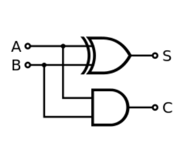
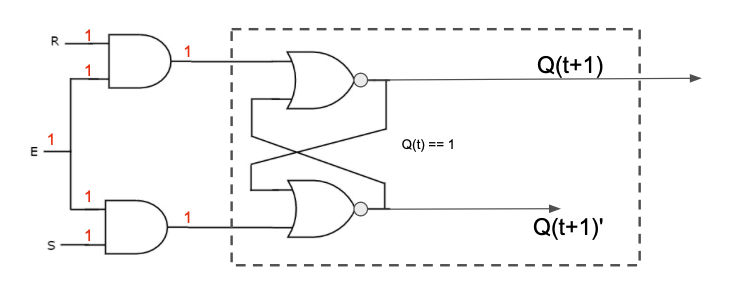
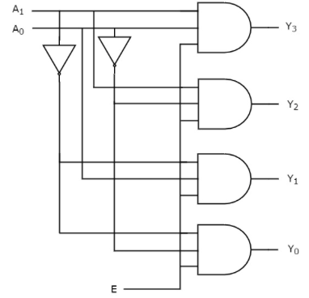

# Digitial Logic 
## Name:  Leonard Balunes                                          <!-- response -->
## GitHub Account:  lbalunes                                <!-- response -->

### Boolean Algebra
1. Given the following circuit, provide the equivalent Boolean expression:
   *  S = A ⊕ B or S = (A+B) * (A'+B')  , C = A * B                                  <!-- response -->

   

 
1. Given the following truth table, provide the equivalent Boolean expression:
   *    A'B'C ,  A'B C' ,   A B'C'  , A B'C ,  A B C'                    <!-- response -->
 
   | A  | B | C  | Output |
   | -- | --|--  | --     |
   | 0  | 0 | 0  | 0      |  A'B'C'
   | 0  | 0 | 1  | 1      |  A'B'C
   | 0  | 1 | 0  | 1      |  A'B C'
   | 0  | 1 | 1  | 0      |  A'B C
   | 1  | 0 | 0  | 1      |  A B'C'
   | 1  | 0 | 1  | 1      |  A B'C
   | 1  | 1 | 0  | 1      |  A B C'
   | 1  | 1 | 1  | 0      |  A B C

1. Convert the following truth table into a Karnaugh map.<br>
   (Make sure you update all of the x-s in the answer template.)
   
   | A | B | C | Output |
   | - | - | - | ------ |
   | 0 | 0 | 0 |   0    |
   | 0 | 0 | 1 |   1    |
   | 0 | 1 | 0 |   1    |
   | 0 | 1 | 1 |   0    |
   | 1 | 0 | 0 |   1    |
   | 1 | 0 | 1 |   1    |
   | 1 | 1 | 0 |   1    |
   | 1 | 1 | 1 |   1    |

   ```
   |   |   | BC | BC | BC | BC |          <!-- response -->
   |   |   | 00 | 01 | 11 | 10 |          <!-- response -->
   |---|---| -- | -- | -- | -- |          <!-- response -->
   | A | 0 | 0  | 1  | 0  | 1  |          <!-- response -->
   | A | 1 | 1  | 1  | 1  | 1  |          <!-- response -->
   ```


1. Simplify the following Boolean expressions:<br>
   1. ``A * ( B + C) + A' * ( B + C) ``
      * A * B + A * C + A' * B + A' * C                          <!-- response -->
      * AB + AC + A'B + A'C                                 <!-- response -->
      * AB + A'B +  AC + A'C                             <!-- response -->
      * (A + A') B + (A + A') C                 <!-- response -->
      * B+C                                     <!-- response -->

   1. ``AB' + A'B + AB``
      *  AB + AB' + A'B    <!-- response -->
      * A(B+B') + A'B    <!-- response -->
      * A * 1+ A'B      <!-- response --> 
      * A + A'B     <!-- response --> 
      * A + B     <!-- response --> 
      
   1. ``(AB' + A'B + AB)'``
      * (A+B)'             <!-- response -->
      * A'+ B'                         <!-- response -->


1. You are provided with a truth table. By what method can you use to determine the equivalent Boolean algebra expression. (Your answer needs to be provided by a simple sentence.)
   ```
   I would use the Karnaugh Map method to determine equivalent boolean expression.           <!-- response -->
   ```

<!-- For the next two questions, you need not include the response tags -->
1. Update the following Karnaugh map by replacing the x's to provide the missing labeling information.

   |   |   | BC <br> 00 | BC <br> 01 | BC <br> 11 | BC <br> 10 |   
   |---|---|         -- |         -- |         -- |         -- |   
   | A | 0 |         1  |         0  |         0  |         1  |   
   | A | 1 |         1  |         0  |         1  |         1  |   


1. For the Karnaugh map in the previous question, provide the equivalent truth table.
   
   | A | B | C | Output |
   | - | - | - | ------ |
   | 0 | 0 | 0 |  1     | A'B'C'
   | 0 | 0 | 1 |  0     |
   | 0 | 1 | 0 |  1     | A'B C'
   | 0 | 1 | 1 |  0     |
   | 1 | 0 | 0 |  1     | A B'C'
   | 1 | 0 | 1 |  0     |
   | 1 | 1 | 0 |  1     | A B C'
   | 1 | 1 | 1 |  1     | A B C

1. Using the above Karnaugh map, provide the equivalent Boolean expressions.
  * C' + AB                 <!-- response -->

1. Using the above truth table, provide the equivalent Boolean expression. Do NOT take steps to simplify the resulting Boolean expression.
   *   A'B'C' + A'B C' + A B'C' + A B C' + A B C                                      <!-- response -->


1. Provide an example for each of the following Boolean algebra properties.

   *  associative property:  
      - (A + B) + C = A + (B+C)                                 <!-- response: example: is this correct? -->
   *  idempotent:
      -  A + A = A                                         <!-- response -->
   *  absorption property:  
      -  A + AB = A                                        <!-- response -->
   *  commutative property:  
      -  A + B == B + A                                         <!-- response -->
   *  distributive property:  
      -  A + (BC) = (A + B) (A + C)                                       <!-- response -->
   *  identity property:
      -  0 + A = A                                         <!-- response -->
   *  definition of XOR:
      -  (A+B) * (A'+B')                                         <!-- response -->
   *  annulment:
      -  A + 1 = 1                                         <!-- response -->
   *  complement:
      -  A + A' = 1                                         <!-- response -->


1. Show the steps to show that `C'(B'C + ABC') + A(BC' + 1)` is equivalent to `A`.
   *  C'(B'C + ABC') + A(BC' + 1)  : given        <!-- response -->
   *  C'(B'C+ABC') + A      : identity law A + 1            <!-- response -->
   *  C'B'C + C'ABC' + A    : distribution law              <!-- response -->
   *  C'B'C + C'AB + A      ; idempotent law C'+C' = C'              <!-- response -->
   *  0 + C'AB + A          ; complement law C'+C = 0                              <!-- response -->
   *  C'AB + A              : identity property 0 + C'AB = C'AB                              <!-- response -->
   *  A                     : absorption law AB + A = A               <!-- response -->
   <!-- Add or Delete response lines above as necessary -->


### Circuits

1. You are given a SR latch that is storing the value of 1. You then provide the following values for inputs:  E=1, S=1, and R=1.  What is the final value for Q(t+1) and for Q(t+1)' ?
   * Q(t+1) : 0                                   <!-- response -->
   * Q(t+1)': 0                                   <!-- response -->




1. You are asked to build a register bank. Identify which of the following digital components you need. (To answer this question, simply remove the digital components your don't need.)
   
   * Decoder ; need                                   <!-- response -->
   * FlipFlop   ; need                                <!-- response -->

       
1. Can all programs be computed via a combinational circuit, yes or no?
   *  No, not all programs can be computed via a combinational circuit                    <!-- response -->
   * Explain your answer:<br>
    <!-- Add additional lines, including the appropriate response tags, in the block below. -->
     ```
     Combinational circuit can't be computed without any registers or memory. It doesn't      <!-- response -->
     store any memory nor does it have the capability to compute with memory.                 <!-- response -->
    ```
1. What is the difference between a control line and a data line?
   *  Control lines control whether a register can be open and control where the data line is going.   <!-- response -->
    Data lines are passageways where values of 0's and 1's are being transported.   <!-- response -->

1. You have been asked to produce a combinational circuit that can select exactly 1 output from 16 different possible inputs.
   1. What basic combinational ciruit should be used?
      *   16 x 1 multiplexer                        <!-- response -->
   1. How many selector lines will this circuit have?
      *   2 ^ N = 16 inputs, N (selector lines) = 4 lines                               <!-- response -->

1. You have a CPU that has 120 registers. (Yes, 120 registers!)
   1. How many selector lines are included in this circuit
      *   2 ^ N = 120 , N = 6.9 or 7                               <!-- response -->

1. Consider the following circuit

   

   1. What is the type of this circuit?
      *  2 to 4 decoder                                <!-- response -->

1. You are provided with a 5-32 Decoder.
   1. What is the role of the "E"nable line?
      *   "E"nable line is considered an "on or off" switch and activate a circuit                      <!-- response -->

   3. What is the total number of inputs to this circuit?
      *  6 inputs                                <!-- response -->

   5. What is the total number of outputs from this circuit?
      *   32 outputs                               <!-- response -->


1. Explain the primary difference between a combinational and a sequential circuit.
   *  Combinational circuit does not utilize memory but sequential circuit does.                                  <!-- response -->
2. What is the primary difference between a SR-latch and a D-latch?
   *  SR latch is given two inputs S and R that are given with 0's or 1's.                                     <!-- response -->
   D latch has an additional input, D, to the SR latch where it forces S and R to be complement.e           <!-- response -->

### Microarchitecture

1. A CPU is an example of a sequential circuit, where different parts of the circuit is executed in well defined steps.  Answer the following questions related to such a sequential circuit.
   1. For the MIPS microarchitcture, enumerate and describe briefly what each of these steps does:
      1. Fetch: PC is incremented by 4, and the next instruction is read from main memory.                        <!-- response -->
      1. Decode: will be used in instruction register to know what it's being asked to do.                      <!-- response -->
      1. Execution: ALU is invovled to execute operations.  
      1. Memory Access: gain any access of memory for the current instruction .                             <!-- response -->
      1. Write back: Put back into register after the previous 4 steps are completed.
      <!-- Feel free to add or remove additional response lines as needed. -->
 
   1. What type of digital component is used between each of these steps?
      *  latches is the digital component used between each steps.                                <!-- response -->
 
   1. Why is the value of the PC incremented by 4 in each "fetch" stage?  
      *   During each fetch stage,  the value of PC is incremented by 4 because MIPS                             <!-- response -->
          Architecture is 4 bytes long. Therefore, it will allow the CPU to follow instructions             <!-- response -->
         through the memory                                                                           <!-- response -->

1. What are the five (5) elements that are defined by an ISA?<br>
   1.  Instruction, Data type, Register, Memory, OS interface                                           <!-- response -->
   <!-- Add additional response lines as needed -->


1. In the MIPS micro-architecture, the PC is incremented for each instruction, during the "Instruction Fetch" stage.  The value of the PC may also be updated later within the "Memory Access" phase.

   * If the value of the PC is: 0x0000 2F1C, what is the value of the PC after you complete the execution of the instruction:  ``addi $t0, $s0, $ra``?
      *  0x0000 2F20                                         <!-- response -->

1. The MIPS I-format includes a 16-bit field, which is used to encode an immediate value.  During the "Instruction Decode" phase this 16-bit value is transformed into a 32-bit value.  For each of the following values, provide 16-bit value that is stored in the instruction and the 32-bit value that is passed to the ALU.
   * 0x7FF7:  
     * 16-bit value: 0111 1111 1111 0111                             <!-- response -->
     * 32-bit value: 0000 0000 0000 0000 0111 1111 1111 0111                      <!-- response -->
   * 0xAAAA:  
     * 16-bit value: 1010 1010 1010 1010                              <!-- response -->
     * 32-bit value: 1111 1111 1111 1111 1010 1010 1010 1010                             <!-- response -->
   * -2:                
     * 16-bit value: 1111 1111 1111 1110                           <!-- response -->
     * 32-bit value: 1111 1111 1111 1111 1111 1111 1111 1110                             <!-- response -->
   * 7:                   
     * 16-bit value: 0000 0000 0000 0111                             <!-- response -->
     * 32-bit value: 0000 0000 0000 0000 0000 0000 0000 0111                             <!-- response -->


